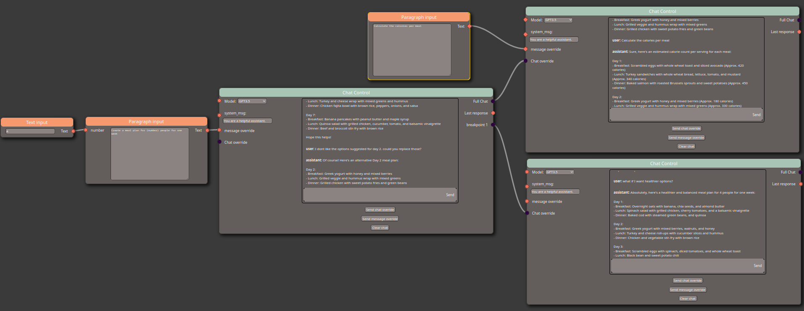

# LinguaFlux

## Introduction

Meet LinguaFlux, a web app that connects various large language models through a no-code interface for Langchain. It lets you create multi-step AI workflows and branching chats with ease. Designed to run locally with Docker, the setup is easy and does not require an account. This tool seeks to bridge the gap between the utility of tools like Langchain, and the ease of use of interfaces like chatGPT.

Currently, this is in early alpha, so expect some bugs. 

## Setup

Linguaflux uses docker to run on your PC. If you are unfamilliar with docker, here is a [cheatsheet](https://github.com/wsargent/docker-cheat-sheet/blob/master/README.md) with an installation guide.

If you have docker already installed, follow these setup steps

1. Copy and rename `.Example_env` to `.env` and add your own API keys.  
    - If you are interested in chatGPT, follow the openAI API [setup instructions](https://openai.com/blog/openai-api)
2. navigate to the root directory of this projectScreenshot_20230425_175057.png
3. run `docker compose up`

If it is your first time trying this project out, I would reccommend checking out the examples. Mouse over file->examples to view a few. 

## Contributing

Have an idea for a cool new feature? Head to the discussions page of this github and upvote a feature you would like to see, or create your own discussion. 

If you find a bug, go to the issues tab and submit a new issue, or submit a pull request if you fixed an issue that is already documented

If you are just like the project but dont know software, you can always help me out with a [donation](https://ko-fi.com/linguaflux).
